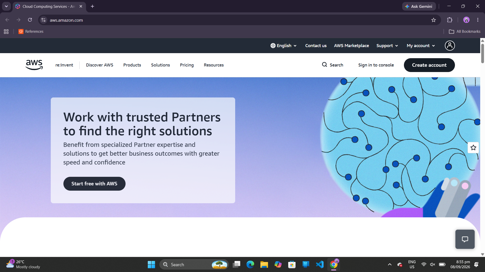
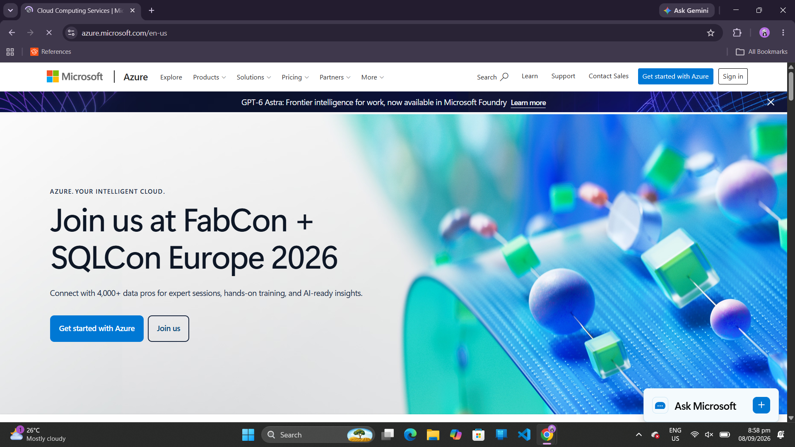
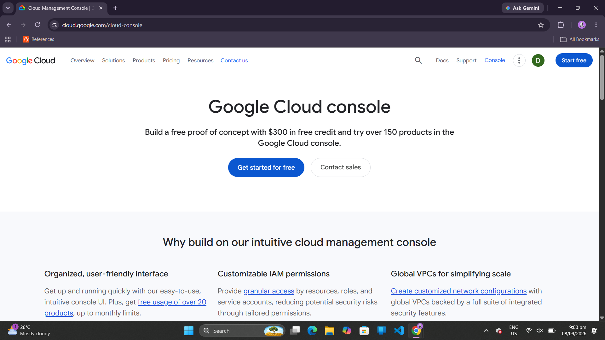

# Laboratory 03 – Multi-Cloud Explorer

## Linux Server Investigation

I launched an Ubuntu Linux Playground using KillerCoda and used Linux commands to examine the server's operating system, processor, memory, and available storage. The information collected provides a basic understanding of the resources available in the cloud-based Linux environment.

## 1. Operating System

**Command used:**

```bash
cat /etc/os-release
```

**Result:**

* Operating System: Ubuntu 24.04.4 LTS
* Version: 24.04
* Codename: Noble Numbat

The server is running Ubuntu 24.04.4 LTS, a Linux distribution commonly used for server and cloud workloads.

### Screenshot

*Add your KillerCoda terminal screenshot here.*

---

## 2. CPU Information

**Command used:**

```bash
lscpu
```

**Result:**

* Architecture: x86_64
* CPU Model: Intel Xeon E312xx (Sandy Bridge, IBRS update)
* Number of CPUs: 1
* CPU Frequency: 2.0 GHz
* CPU Cores: 1
* Virtualization: Full
* Hypervisor: KVM

The server is configured with one virtual CPU core using an Intel Xeon E312xx processor. The environment is also running through KVM virtualization.

### Screenshot

*Add your KillerCoda terminal screenshot here.*

---

## 3. Memory

**Command used:**

```bash
free -h
```

**Result:**

* Total Memory: 1.9 GiB
* Used Memory: 414 MiB
* Free Memory: 851 MiB
* Available Memory: 1.5 GiB
* Swap: 1.0 GiB

The Linux environment provides approximately 1.9 GiB of RAM, with additional swap space available when required.

### Screenshot

*Add your KillerCoda terminal screenshot here.*

---

## 4. Disk Space

**Command used:**

```bash
df -h
```

**Result:**

* Root Filesystem Size: 19 GiB
* Used Space: 5.4 GiB
* Available Space: 13 GiB
* Usage: 30%

The main filesystem provides 19 GiB of storage, with approximately 13 GiB currently available.

### Screenshot

*Add your KillerCoda terminal screenshot here.*

---

# Cloud Migration Options

The Linux server environment could be hosted using virtual machine services from AWS, Microsoft Azure, or Google Cloud. These providers offer cloud infrastructure that can support Linux-based workloads.

| Cloud Provider  | Cloud Service          | Purpose                                                                  |
| --------------- | ---------------------- | ------------------------------------------------------------------------ |
| AWS             | Amazon EC2             | Provides scalable virtual computing capacity for running Linux workloads |
| Microsoft Azure | Azure Virtual Machines | Provides virtual machines for running Linux and other workloads          |
| Google Cloud    | Compute Engine         | Provides virtual machines for applications and cloud workloads           |

## AWS

AWS provides a wide range of cloud services for computing, storage, networking, security, databases, and other workloads. Amazon EC2 is one of its compute services and provides resizable computing capacity for applications. Amazon S3 provides object storage for files and other data. AWS also provides networking and identity services as part of its cloud platform.

**Source:**
[AWS – About AWS](https://aws.amazon.com/about-aws/?utm_source=chatgpt.com)

### AWS Services

| Service    | Purpose                                   |
| ---------- | ----------------------------------------- |
| Amazon EC2 | Runs virtual machines and cloud workloads |
| Amazon S3  | Stores objects and files                  |
| Amazon VPC | Provides virtual networking               |
| AWS IAM    | Controls access to AWS resources          |

### Screenshot



---

## Microsoft Azure

Microsoft Azure is Microsoft's cloud computing platform. It provides services for computing, storage, databases, networking, application development, security, and other cloud workloads. Azure also supports Linux virtual machines, allowing Linux distributions such as Ubuntu to run in the Azure environment.

**Source:**
[Microsoft Azure](https://azure.microsoft.com/en-us?utm_source=chatgpt.com)

### Azure Services

| Service                | Purpose                                 |
| ---------------------- | --------------------------------------- |
| Azure Virtual Machines | Runs Linux and Windows virtual machines |
| Azure Blob Storage     | Stores cloud data and objects           |
| Azure Virtual Network  | Provides private cloud networking       |
| Microsoft Entra ID     | Manages identities and access           |

### Screenshot



---

## Google Cloud

Google Cloud provides cloud infrastructure and services that can be managed through the Google Cloud Console. The console allows users to create and manage virtual machines with Compute Engine, configure networking through VPC, and manage access using IAM permissions.

**Source:**
[Google Cloud Console](https://cloud.google.com/cloud-console?utm_source=chatgpt.com)

### Google Cloud Services

| Service        | Purpose                             |
| -------------- | ----------------------------------- |
| Compute Engine | Runs virtual machines and workloads |
| Cloud Storage  | Stores files and objects            |
| VPC            | Provides cloud networking           |
| Cloud IAM      | Controls access to cloud resources  |

### Screenshot



---

# Comparison

| Feature           | AWS        | Microsoft Azure        | Google Cloud   |
| ----------------- | ---------- | ---------------------- | -------------- |
| Virtual Machines  | Amazon EC2 | Azure Virtual Machines | Compute Engine |
| Storage           | Amazon S3  | Azure Blob Storage     | Cloud Storage  |
| Networking        | Amazon VPC | Azure Virtual Network  | VPC            |
| Identity & Access | AWS IAM    | Microsoft Entra ID     | Cloud IAM      |
| Linux Support     | Yes        | Yes                    | Yes            |

Based on the investigation, all three platforms can provide the computing, storage, networking, and access-management capabilities needed to host a Linux-based system. The final choice would depend on the client's budget, technical requirements, existing infrastructure, and preferred cloud ecosystem.

